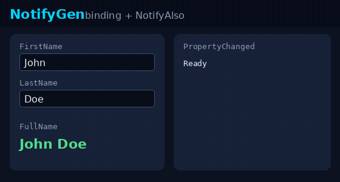

# NotifyGen

**Zero-runtime `INotifyPropertyChanged` source generator.**



```bash
dotnet add package NotifyGen
```

```csharp
using NotifyGen;

[Notify]
public partial class Person
{
    private string _firstName;
    private string _lastName;

    [NotifyComputed]
    public string FullName => $"{FirstName} {LastName}";
}
```

## Start here

- [Generated code before / after](before-after.md) — aha without cloning
- [Migrate from CommunityToolkit](migrate.md) — coexistence checklist
- [Features](features.md) — full reference
- [Samples](samples.md) — WPF, Avalonia, MAUI, Hybrid

**Recommended stack:** NotifyGen for properties, CommunityToolkit.Mvvm for commands.
